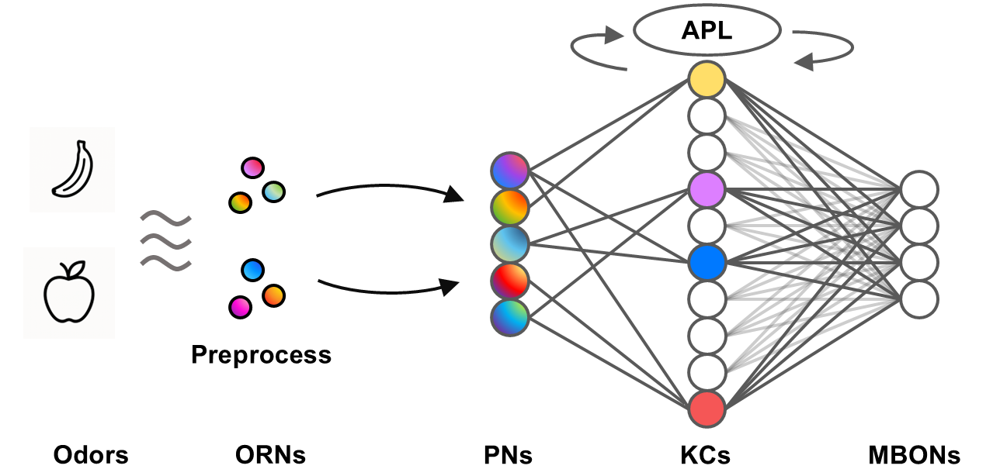

# Fly-CL: A Fly-Inspired Framework for Enhancing Efficient Decorrelation and Reduced Training Time in Pre-trained Model-based Continual Representation Learning

This repository contains the official implementation of our paper:
**"Fly-CL: A Fly-Inspired Framework for Enhancing Efficient Decorrelation and Reduced Training Time in Pre-trained Model-based Continual Representation Learning."**



## 🧠 Abstract

Using a nearly-frozen pretrained model, the continual representation learning paradigm reframes parameter updates as a similarity-matching problem to mitigate catastrophic forgetting. However, directly leveraging pretrained features for downstream tasks often suffers from multicollinearity in the similarity-matching stage, and more advanced methods can be computationally prohibitive for real-time, low-latency applications. Inspired by the fly olfactory circuit, we propose Fly-CL, a bio-inspired framework compatible with a wide range of pretrained backbones. Fly-CL substantially reduces training time while achieving performance comparable to or exceeding that of current state-of-the-art methods. We theoretically show how Fly-CL progressively resolves multicollinearity, enabling more effective similarity matching with low time complexity. Extensive simulation experiments across diverse network architectures and data regimes validate Fly-CL’s effectiveness in addressing this challenge through a biologically inspired design.

## ⚙️ Environment Setup

Experiment Configuration using Miniconda. People can create environment using following command
```
conda create -n FlyCL python=3.9
conda activate FlyCL
conda install pytorch==1.13.1 torchvision==0.14.1 pytorch-cuda=11.7 -c pytorch -c nvidia
conda install "numpy<2.0.0"
conda install timm==0.9.16 tqdm
conda install scipy
```

## Pre-trained Model Download

Download the pretrained models using the provided script `pretrained_model/download.sh`

## 🚀 Running Experiments

We provide example scripts for running experiments with the CIFAR-100, CUB-200-2011, and VTAB datasets.
```bash
cd scripts
./test_cifar.sh
./test_cub.sh
./test_vtab.sh
```

## 📬 Contact

If you have any questions or feedback, please feel free to reach out:  
📧 [zouhm24@mails.tsinghua.edu.cn](mailto:zouhm24@mails.tsinghua.edu.cn)